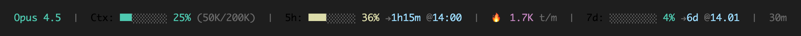

# Claude Code Statusline

A rich status line for [Claude Code](https://docs.anthropic.com/en/docs/claude-code) that shows context usage, rate limits, and cost tracking.


[](https://github.com/Benniphx/claude-statusline/actions/workflows/test.yml)

## Features

### Subscription Mode


- **Context Window**: Progress bar + percentage + tokens used/max
- **5h Rate Limit**: Usage + time until reset + local reset time (rounded to 5min)
- **Burn Rate**: Tokens/min with warning if limit will be hit before reset
- **7d Rate Limit**: Usage + days until reset + reset date

### API-Key Mode


- **Context Window**: Same as above
- **Session Cost**: Current session spending
- **Daily Cost**: Cumulative daily spending across all sessions
- **Burn Rate**: Tokens/min + $/hour

### Color Coding
- 🟢 **Green**: < 50% (all good)
- 🟡 **Yellow**: 50-80% (attention)
- 🔴 **Red**: > 80% (critical)

### Warning System
Warnings only appear when there's a problem:
- `🔥 16K t/m ⚠️ 45m @12:40` - Will hit limit BEFORE reset
- `7d: 60% ⚠️` - Usage exceeds expected rate

## Requirements

- **macOS** or **Linux/WSL**
- `jq` for JSON parsing
- `curl` for API calls

```bash
# macOS
brew install jq

# Linux/WSL
sudo apt install jq
```

## Installation

### Plugin Install (Recommended)

Install as a Claude Code plugin for automatic updates:

```bash
# Add the marketplace
claude plugin marketplace add Benniphx/claude-statusline

# Install the plugin
claude plugin install statusline
```

The plugin automatically:
- Installs `statusline.sh` to `~/.claude/`
- Configures `settings.json`
- Updates on plugin update

### Upgrading from v1.x

If you had a previous version installed and see `[Update]` after installing the plugin:

```bash
curl -o ~/.claude/statusline.sh https://raw.githubusercontent.com/Benniphx/claude-statusline/main/scripts/statusline.sh
chmod +x ~/.claude/statusline.sh
```

Then restart Claude Code.

### Manual Install

```bash
# Download the script
curl -o ~/.claude/statusline.sh https://raw.githubusercontent.com/Benniphx/claude-statusline/main/scripts/statusline.sh
chmod +x ~/.claude/statusline.sh

# Add to Claude Code settings (~/.claude/settings.json)
{
  "statusLine": {
    "type": "command",
    "command": "~/.claude/statusline.sh"
  }
}
```

## Plugin Commands

When installed as a plugin:

- `/statusline:config` - Check configuration and troubleshoot issues

## Configuration

The script auto-detects your account type:
- **Subscription (OAuth)**: Shows rate limits from Anthropic API
- **API-Key**: Shows cost tracking

No configuration needed - just install and restart Claude Code.

### Credential Storage

| Platform | Location |
|----------|----------|
| macOS | Keychain (`Claude Code-credentials`) |
| Linux/WSL | `~/.claude/.credentials.json` or `~/.claude/credentials.json` |
| All | `CLAUDE_CODE_OAUTH_TOKEN` environment variable (highest priority) |

## Cache Files

The script uses temporary cache files to minimize API calls:
- `/tmp/claude_rate_limit_cache.json` - Rate limit data (60s TTL)
- `/tmp/claude_display_cache.json` - Fallback display values
- `/tmp/claude_daily_cost_YYYY-MM-DD.txt` - Daily cost tracking
- `/tmp/claude_statusline_update.txt` - Update check cache (24h TTL)

Cache is automatically invalidated when rate limit resets.

## Troubleshooting

### No rate limit data showing

**macOS:**
```bash
# Check if OAuth credentials exist
security find-generic-password -s "Claude Code-credentials" -w | jq '.claudeAiOauth'
```

**Linux/WSL:**
```bash
# Check if credentials file exists
cat ~/.claude/.credentials.json | jq '.claudeAiOauth'
```

**Clear cache and retry:**
```bash
rm -f /tmp/claude_rate_limit_cache.json /tmp/claude_display_cache.json
```

### Wrong timezone
The script converts UTC timestamps from the API to your local timezone automatically.

## Development

### Running Tests

```bash
./tests/test_statusline.sh
```

### Project Structure

```
claude-statusline/
├── .claude-plugin/
│   └── plugin.json       # Plugin manifest
├── commands/
│   └── config.md         # /statusline:config command
├── hooks/
│   └── hooks.json        # SessionStart hook
├── scripts/
│   ├── statusline.sh     # Main status line script
│   └── install.sh        # Auto-installer
├── tests/
│   └── test_statusline.sh
└── .github/
    └── workflows/
        └── test.yml      # CI pipeline
```

## License

MIT License - feel free to use and modify.

## Contributing

Issues and PRs welcome!
